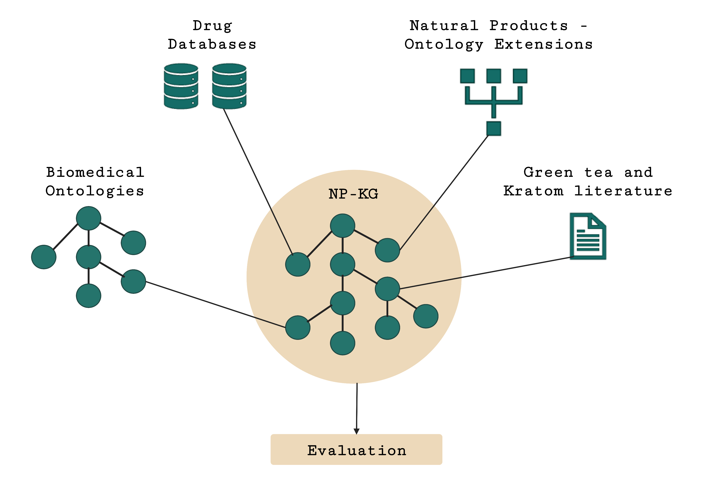

# NP-KG

**Knowledge Graph Framework to Generate Hypotheses for Natural Product-Drug Interactions**

NP-KG is a graph framework that creates a biomedical knowledge graph (KG) to identify and generate mechanistic hypotheses for pharmacokinetic natural product-drug interactions (NPDIs). NP-KG uses the [PheKnowLator ecosystem](https://github.com/callahantiff/PheKnowLator) to create an ontology-grounded KG. It then uses two relation extraction systems to extract triples from natural product-related biomedical literature to create a literature-based graph, and integrates the nodes and edges in the ontology-grounded KG. 

## NP-KG Builds

**NP-KG (Merged KG):** 

**Ontology-grounded KG:** 

**Literature-based Graph:** 

## How to Download and Use

### If you want to use the pre-built KGs

Simply download the KG files from [this link](#). NP-KG is available as NetworkX multidigraph (gpickle files) and RDF triples (ntriples files). See [evaluation-scripts](https://github.com/sanyabt/np-kg/tree/main/evaluation-scripts) for examples of queries and path searches.

### If you are interested in constructing or extending NP-KG

See [wiki](https://github.com/sanyabt/np-kg/wiki) for details of data sources, construction, use cases, and evaluation.

Get In Touch
------------------------------------------------

Get in touch through GitHub issues, discussion, or [email](mailto:sbt12@pitt.edu)!

Citations
------------------------------------------------

**AMIA Informatics Summit poster**

Taneja SB, Ndungu PW, Paine MF, Kane-Gill SL, Boyce RD. Relation Extraction from Biomedical Literature on Pharmacokinetic Natural Product-Drug Interactions. Poster presentation, AMIA Informatics Summit 2022; March 21-24, 2022.

**ISMB Conference Abstract and Related Files**

Taneja SB, Callahan TJ, Brochhausen M, Paine MF, Kane-Gill SL, Boyce RD. Designing potential extensions from G-SRS to ChEBI to identify natural product-drug interactions. Intelligent Systems for Molecular Biology/European Conference on Computational Biology (ISMB/ECCB), 2021. [https://doi.org/10.5281/zenodo.5736386](https://doi.org/10.5281/zenodo.5736386)

This work is supported by the National Institutes of Health National Center for Complementary and Integrative Health Grant U54 AT008909.
