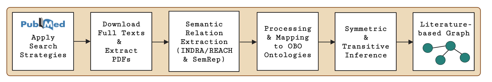

## Relation Extraction Workflow for Literature-based Graph

### Notebooks

1. process_reach_data.ipynb
2. process_semrep_data.ipynb
3. run_closure_machine_read.ipynb
4. merge_machine_read_graphs.ipynb

Output is saved in ./output_graphs/