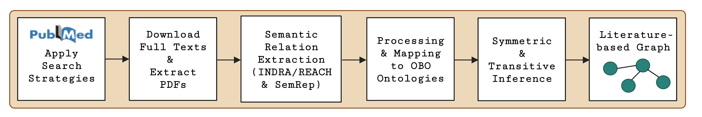

## Relation Extraction Workflow for Literature-based Graph

### Scripts:
1. *indraREACH_extract.py*
2. *machineReadMain.py*
3. *NER_metamap.py*
4. *pdf_to_text.py*
5. *reachJSONextraction.py*
6. *semrep_process_pmid.py*
7. *semrep_process_error_files.py*
8. *semrepExtract.py*